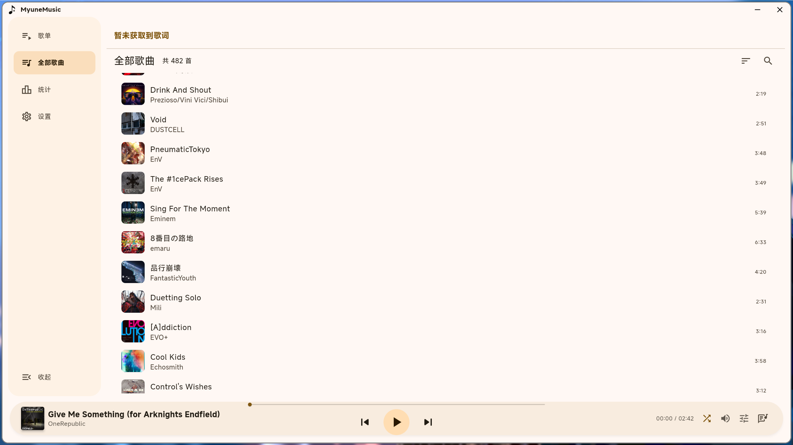
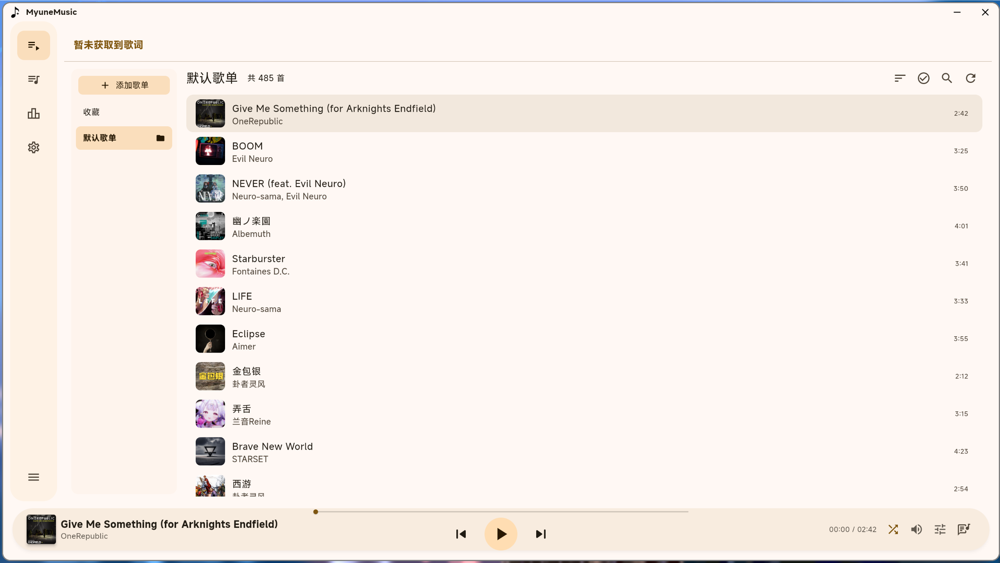
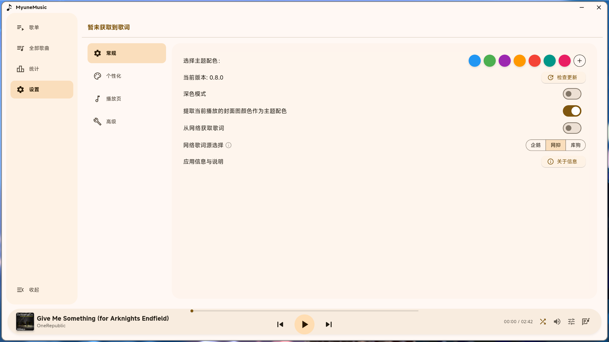

# 🎵 Myune Music

一个基于 **Flutter (Dart)** 实现的简洁本地音乐播放器，支持 **Windows / Linux** 双端。

> 🍎 macOS 用户可使用社区移植版：[myune_music_macos](https://github.com/Lannamokia/myune_music_macos)

## ✨ 特性
* 💻 支持 **Windows / Linux** 双平台
* 🎶 歌曲管理：支持 **文件夹歌单** 与 **手动歌单**
* 🧠 自动按 **歌手** 与 **专辑** 分类
* 🎨 使用 [Material 3](https://m3.material.io/) 组件与配色
* 🎧 自动读取音频元数据，支持多种格式
* 📝 歌词支持：内嵌歌词、本地 `.lrc`、网络歌词源
* 🔊 提供 **音调控制** 与 **倍速播放**
* ✨ 可自定义主题配色与字体
* 🖥️ 集成 **SMTC（系统媒体传输控制）** 与 **MPRIS（Linux）**
* 🧩 支持 **音频独占模式**（仅 Windows）
* 🔌 支持 **手动选择音频输出设备**

## � 本分支特性

本分支在原版基础上进行了以下改进：

* **🎨 界面风格优化**：
  * 更加统一的 Material 3 风格
  * 修改了了对话框交互体验，修复了部分 UI 细节
* **🛠️ 代码重构**：
  * 重构了歌单管理逻辑，提取了通用组件
  * 修复了部分内存泄漏问题和组件错误
  * 提高了代码复用性与稳定性
  * 调整了部分UI逻辑，动态调整，防止不同分辨率下可能的错位
  **功能新增**：
  * 通过输入路径的方式添加音乐文件夹

  

## �🎵 歌曲管理说明

播放器提供两种管理方式：**文件夹模式** 与 **手动模式**。

### 🗂️ 文件夹模式

* 添加歌单时选择“**添加文件夹**”，可选多个路径
* 自动扫描文件夹及其子目录内的所有歌曲
* 可通过右键菜单添加 / 删除文件夹
* 手动点击“**刷新按钮**”可更新歌曲列表
* ⚠️ 文件夹模式中无法手动添加或删除单曲

### 📝 手动模式

* 创建歌单时选择“**手动管理歌单歌曲**”
* 可自由添加 / 删除歌曲
* 支持批量选择文件并自动去重

> 两种方式均支持按 歌手/专辑 分类展示

## 🎶 关于桌面歌词
由于 [Flutter](https://flutter.dev/) 暂不支持多窗口功能，因此暂未提供桌面歌词。
可使用以下第三方工具替代：

* [Lyricify Lite](https://apps.microsoft.com/detail/9nltpsv395k2)
* [BetterLyrics](https://apps.microsoft.com/detail/9p1wcd1p597r)

> 以上软件非本人开发，请支持原作者 🙏

## 🌐 关于歌词

目前仅支持UTF-8编码的 **.lrc** 文件

默认情况下，将会优先读取内嵌歌词，如果没有则读取本地 `.lrc` 文件

如果上述都无歌词的话，可以在设置中启用 **从网络获取歌词**

启用后，将在未读取到**内联歌词**和本地 `.lrc` 文件自动获取歌词

软件内默认提供了两个歌词源可供选择

实现参考 [通过歌曲名获取原文+翻译歌词](https://www.showby.top/archives/624)

### 🎵 关于歌词解析

假设有如下格式的歌词

>[02:55.031]照らされた世界 咲き誇る大切な人
>
>[02:55.031]在这阳光普照的世界 骄傲绽放的重要之人
>
>[02:55.031]te ra sa re ta se ka i sa ki ho ko ru ta i se tsu na hi to

可以看到这三句歌词对应的时间戳是相同的，那么软件内就会把它识别为同一句歌词的不同行

上述格式从上到下对应原文/翻译/罗马音

软件内提供设置`同时间戳歌词行数`，例如调整数值为2，最后一行（罗马音）就不会被显示

## 📦 内嵌元数据支持

| 音频格式     | 元数据格式               | 支持 |
|-------------|-------------------------|-------|
| MP3         | `ID3v1`, `ID3v2`        | ✅   |
| MP4         | `iTunes-style ilst`     | ✅   |
| FLAC        | `Vorbis Comments`       | ✅   |
| OGG         | `Vorbis Comments`       | ✅   |
| Opus        | `Vorbis Comments`       | ✅   |
| WAV         | `RIFF`                  | ✅   |

## 🎵 支持的音频格式

由于底层采用 **[mpv](https://mpv.io)** 播放引擎（基于 FFmpeg），理论上支持几乎所有常见及部分非常规的音频格式，包括但不限于：

| 类型          | 格式示例                                               | 说明                      |
| ----------- | -------------------------------------------------- | ----------------------- |
| **无损格式**    | `FLAC`, `ALAC`, `APE`, `WAV`, `AIFF`, `DSF`, `DFF` | 支持高解析度音频、无损压缩或未压缩格式     |
| **有损格式**    | `MP3`, `AAC`, `M4A`, `OGG`, `OPUS`, `WMA`, `MP2`   | 主流压缩格式，兼容性极佳            |
| **其他实验性格式** | `TTA`, `WV`, `SPX`, `CAF` 等                        | FFmpeg 原生支持的冷门格式        |

### 🛠️ 启用冷门格式支持

若需要播放非常规音频格式（例如 `TTA`、`WV` 等），请前往设置菜单：

1. 打开 **设置**
2. 转到 **高级**
3. 启用 **允许添加任何格式的文件**

此操作会允许添加任何格式的文件到软件内

## 🔧关于 Linux

目前 Linux 版本仅在 **Fedora 42 + Niri(Wayland)** 测试过，已知问题有**无法选择字体**

### 在使用前安装依赖

需要安装 `libmpv`

## 🧱 使用的依赖与致谢

| 插件                                                                      | 功能             |
| ----------------------------------------------------------------------- | -------------- |
| [audio_metadata_reader](https://pub.dev/packages/audio_metadata_reader) | 读取音频元信息        |
| [media_kit](https://pub.dev/packages/media_kit)                         | 音频播放支持         |
| [anni_mpris_service](https://pub.dev/packages/anni_mpris_service)       | D-Bus MPRIS 控件 |

更多依赖请查看 [pubspec.yaml](pubspec.yaml)。

特别感谢：

* [xiaobaimc](https://github.com/xiaobaimc) (原作者)
* [爱情终是残念](https://aqzscn.cn/archives/flutter-smtc)
* [Ferry-200](https://github.com/Ferry-200/coriander_player)

> 提供了 Rust + Flutter 的 SMTC 实现参考 🙏

## 📄 许可证

本项目使用 **Apache License 2.0** 开源许可协议。
详细内容请查看根目录下的 [LICENSE](/LICENSE) 文件。

## 🔤 字体版权说明（Font License）

本项目使用小米公司提供的 **MiSans 字体**，该字体已明确允许**免费商用**。

* 字体版权归小米公司所有
* 相关许可协议请查阅：[MiSans 字体知识产权使用许可协议](https://hyperos.mi.com/font-download/MiSans%E5%AD%97%E4%BD%93%E7%9F%A5%E8%AF%86%E4%BA%A7%E6%9D%83%E8%AE%B8%E5%8F%AF%E5%8D%8F%E8%AE%AE.pdf)
* MiSans 官网：[https://hyperos.mi.com/font/](https://hyperos.mi.com/font/)
